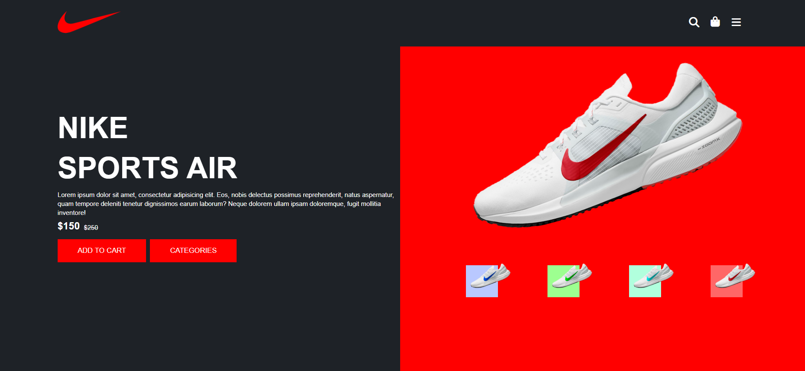
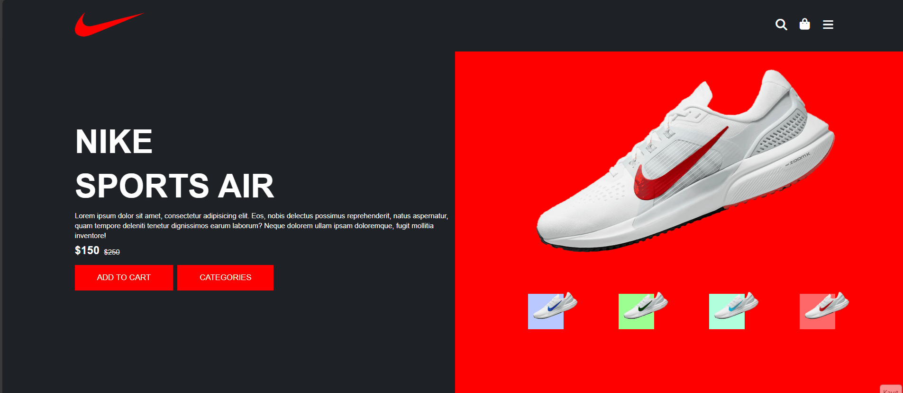

<!DOCTYPE html>
<html lang="tr">
<head>
<meta charset="UTF-8">

</head>

<body>

<h1 align="center">👟 AirStep UI</h1>

HTML ve CSS kullanılarak geliştirilmiş modern ve responsive bir ayakkabı markasının klonlanmış tanıtım arayüzü.

<h2>📌 Proje Hakkında</h2>

airstep-ui, özgün tasarıma sahip modern bir landing page çalışmasıdır.
Proje yalnızca HTML ve CSS kullanılarak geliştirilmiştir.
Amaç: modern kullanıcı arayüzü tasarlamak ve frontend geliştirme pratiği yapmaktır.

<ul>
<li>Modern ürün tanıtım sayfası</li>
<li>Responsive tasarım</li>
<li>Temiz ve okunabilir kod yapısı</li>
<li>Minimal UI yaklaşımı</li>
<li>Font Awesome ikon entegrasyonu</li>
</ul>

<h2>🛠 Kullanılan Teknolojiler</h2>

<ul>
<li>HTML5</li>
<li>CSS3</li>
<li>Font Awesome</li>
</ul>

<h2>📂 Proje Yapısı</h2>

<pre>
airstep-ui/
│
├── images/
│   ├── logo.png
│   ├── nike.png
│   ├── nike-b.png
│   ├── nike-g.png
│   └── nike-s.png
├── index.html
├── style.css
├── README.html
├── airstep.png
└── airstep.gif
</pre>

<h2>✨ Özellikler</h2>

<ul>
<li>Modern landing page tasarımı</li>
<li>Responsive grid yapı</li>
<li>Ürün tanıtım arayüzü</li>
<li>Minimal navigasyon bar</li>
<li>Ürün görsel galeri alanı</li>
<li>Mobil uyumlu tasarım</li>
</ul>

<h2>📸 Proje Önizleme</h2>

<h2>⚙️ Canlı Demo</h2>

<h2>🎯 Amaç</h2>

Bu proje frontend geliştirme pratiği yapmak, modern UI tasarımını öğrenmek ve portfolyo için
özgün bir arayüz örneği oluşturmak amacıyla hazırlanmıştır.

<h2>👨‍💻 Geliştirici</h2>

<strong>Kenan Sönmez</strong> 
Frontend Developer

🔗 GitHub: 
<a href="https://github.com/kenansonmez1617-hub" target="_blank">
https://github.com/kenansonmez1617-hub
</a>

💼 LinkedIn: 
<a href="https://www.linkedin.com/in/kenan-sonmez" target="_blank">
https://www.linkedin.com/in/kenan-sonmez
</a>

<h2>📄 Lisans</h2>

Bu proje eğitim amaçlı geliştirilmiştir.
Serbestçe kullanılabilir ve geliştirilebilir.

⭐ Eğer projeyi beğendiyseniz yıldız vermeyi unutmayın!

</body>
</html>
